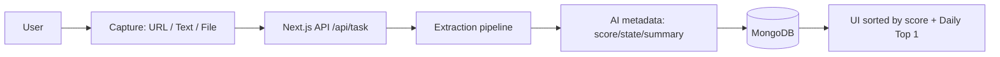

# Librain — AI that decides your next best action

> **HackUDC · GPUL Tracks**
>
> - **Best Open Source Project** (built to be shared, improved, and sustained)
> - **Best Use of Open Source AI** (local OSS models via Ollama)
>
> Librain turns unstructured inputs (URLs, text, files) into **actionable knowledge** and recommends the **single best next action** based on your preferences.


## Live Demo

- Production: https://librain.vercel.app


## Why Librain

Most productivity tools help you *store* tasks. The real pain happens earlier:

**The hardest step is deciding what to do next.**
That first decision creates friction, procrastination, and mental clutter.

**Librain removes the decision cost** by using AI + your preferences to score and rank your initiatives, then surfaces the optimal next step (starting with a daily “Top 1”).

---

## What it does (today)

- **Frictionless capture** from:
  - URL
  - free text
  - files: **PDF / image / audio**
- **AI enrichment** for each item:
  - `name` (title)
  - `state` (maturity stage)
  - `score` (0–100)
  - `descriptionIA` (short actionable summary)
- **Decision-first experience**
  - Home sorted by `score desc`
  - Daily view that highlights your **Top 1** priority
- **Private workspace**
  - Authentication with email/password, Google and GitHub
  - Per-user isolation of stored items
- **LibrainAI** embedded assistant to guide usage inside the app

---

## HackUDC award alignment

### ✅ Best Open Source Project (spirit + maintainability)


| Criteria               | How Librain meets it                                                     |
| ---------------------- | ------------------------------------------------------------------------ |
| Documentation          | Clear README, quickstart, architecture & API docs                        |
| Licensing & standards  | MIT License, standard repo files, templates                              |
| Contribution readiness | CONTRIBUTING, issue templates, PR template                               |
| Code quality           | Modular extraction pipeline + typed domain models                        |
| Utility                | Solves a real problem: reduces decision friction by deciding next action |

### ✅ Best Use of Open Source AI (transparency + local-first)

We use a **multi-provider AI layer**:

- **Ollama (Docker)** to run **open-source models locally** (local-first mode)
- **Google Gemini** as a cloud provider option
- **ChatGPT (OpenAI)** as a cloud provider option

See **AI_TRANSPARENCY.md** for details on providers, configuration and how to run with Ollama.

---

## Quickstart (local)

### Prerequisites

- Node.js **20+**
- pnpm (recommended)
- Docker (for local MongoDB)
- (Optional) Docker for **Ollama** local LLM mode

### 1) Install dependencies

```bash
npm install
```

### 2) Start MongoDB

```bash
docker compose up -d mongodb
```

### 3) Configure environment

Create `.env` from `.env.template` and fill the required values.

### 4) Run the app

```bash
npm run dev
```

Open: http://localhost:3000

---

## How “decision” works (scoring)

Librain assigns every initiative a `score (0–100)` and sorts your inbox by priority.

The score is computed using:

- **Signals extracted from the content** (what it is, implied urgency/actionability, etc.)
- **User preferences** (anything the user considers meaningful: interests, goals, priorities, personal lines of thought)
- **State / maturity** (to push “next steps” over vague raw inputs)

> The goal is not just ranking—it's producing a *next action* that reduces decision fatigue.

---

## Privacy note

- **Only AI-extracted content is stored** (not the raw original file).
- AI providers will process extracted text to generate metadata and summaries.

---

## Architecture (overview)

**Next.js App Router (Node.js runtime)** + MongoDB + multimodal AI.

### High-level flow — Create a task

1. Client sends input (URL / text / file)
2. `POST /api/task` validates session and normalizes input
3. Extraction per type:
   - PDF: `unpdf`
   - Image: vision (OCR-like extraction)
   - Audio: transcription
   - Video URL: interpreted when URL points to a video extension
   - Generic URL: stored as plain text `URL: ...` (roadmap: safe web extraction)
4. Extracted text goes to `generateStoredMetadata(...)`
5. Task is saved in MongoDB
6. UI reads tasks sorted by `score desc`

### Diagram (conceptual)



---

## Repository structure

```text
.github/
src/
  app/
    api/
  actions/
  components/
  db/
  lib/
proxy.ts
```

---

## API contracts (summary)

### `POST /api/task`

Create a task from JSON (`url|text`) or multipart (`file`).

**JSON**

```json
{
  "resource": "url | text",
  "value": "...",
  "description": "optional context"
}
```

**Multipart**

- `resource = file`
- `description`
- `value` (filename)
- `file`

**Success response**

```json
{
  "stored": { "_id": "..." },
  "ai": { "fallback": false, "error": null }
}
```

### `DELETE /api/task/:id`

Delete a task owned by the authenticated user.

### `POST /api/librain-assistant`

```json
{
  "message": "...",
  "currentRoute": "/profile",
  "history": [{ "role": "user", "content": "..." }]
}
```

Response:

```json
{ "answer": "..." }
```

---

## Environment variables


| Variable                        |         required | Description               |
| ------------------------------- | ---------------: | ------------------------- |
| `BETTER_AUTH_SECRET`            |         required | Better Auth secret        |
| `BETTER_AUTH_URL`               |         required | Public base URL           |
| `MONGODB_URI`                   |         required | MongoDB connection string |
| `GITHUB_CLIENT_ID`              |         required | GitHub OAuth              |
| `GITHUB_CLIENT_SECRET`          |         required | GitHub OAuth              |
| `GOOGLE_CLIENT_ID`              |         required | Google OAuth              |
| `GOOGLE_CLIENT_SECRET`          |         required | Google OAuth              |
| `GROQ_API_KEY`                  | ✅ (image/audio) | Multimodal extraction     |
| `GEMINI_API_KEY`                |        optional* | Gemini metadata/assistant |
| *(optional: Ollama local mode)* |                  | see`AI_TRANSPARENCY.md`   |

---

## Contributing

We welcome issues and pull requests.

- Read **CONTRIBUTING.md**
- Look for issues labeled **good first issue** / **help wanted**
- Keep changes small, typed, and documented

---

## Roadmap (post-hackathon)

- Safe web-page extraction for generic URLs (scraping + parsing + citations)
- Export / import from UI (data control)
- Bulk actions + advanced filtering
- Notifications / reminders
- Persisted assistant chats (opt-in)

---

## Team

- **Lucas Ortins Méndez**
- **Diego González Soto**
- **Nicolás Outerelo**

---

## License

MIT — see **LICENSE**.

---

## Security

Please report vulnerabilities privately: **lucasortins@gmail.com**
See **SECURITY.md** for the process.
